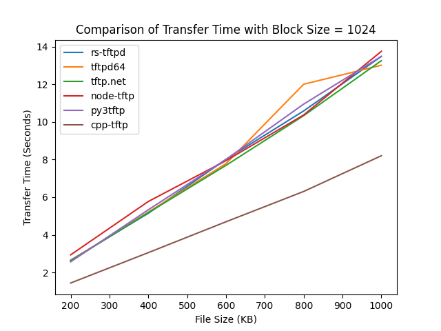

# TFTP Server Benchmark

Speed comparison TFTP Server implementations in different languages.

## Tests

The servers are tested on a Windows server, using the [time.sh](./time.sh) script on a Linux client. The servers are tested using various file sizes and blocksizes.

## Servers Used

- [rs-tftpd](https://github.com/altugbakan/rs-tftpd) (Rust)
- [tftpd64](https://github.com/PJO2/tftpd64/) (C)
- [cpp-tftp](https://github.com/GkWare-e-K-Streamguru/TFTP) (C++)
- [tftp.net](https://github.com/Callisto82/tftp.net) (C#)
- [node-tftp](https://github.com/gagle/node-tftp) (JS)
- [py3tftp](https://github.com/sirMackk/py3tftp) (Python)

## Results

The comparison of the results for Blocksize = 1024 are plotted below using [plot.py](./plot/py).

